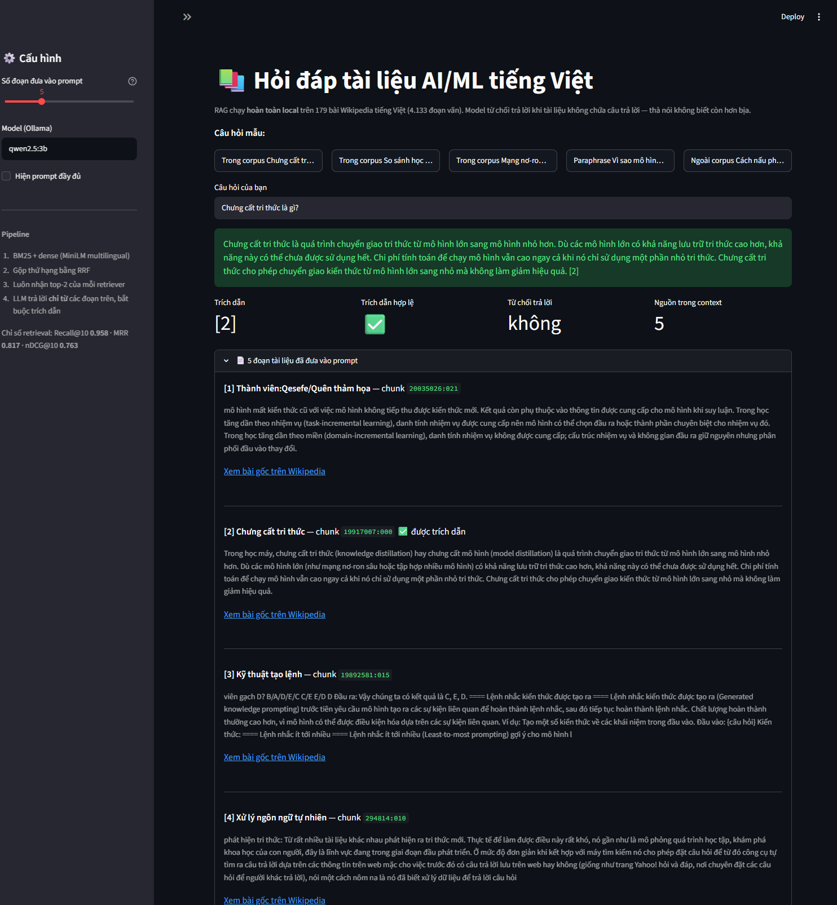

# Vietnamese RAG Q&A — retrieval you can measure

A retrieval-augmented Q&A pipeline over **Vietnamese documents**, built to answer one
question honestly: *which retrieval strategy actually works, and by how much?*

Most RAG demos stop at "it runs". This one is **eval-first**: the ground-truth query set
(qrels) is written **before** the pipeline, so every design choice — chunk size, BM25 vs
dense, hybrid fusion — is justified by a measured delta in MRR / nDCG@k, not by vibes.

## Status



| Stage | State |
|---|---|
| Corpus acquisition | ✅ 447 crawled → **179 curated** articles |
| Chunking | ✅ **4,133** chunks · 553 chars avg · 2.0% filtered as junk |
| BM25 baseline | ✅ Recall@10 0.875 · MRR 0.718 · nDCG@10 0.680 |
| Dense retrieval | ✅ Recall@10 0.819 · MRR 0.621 · nDCG@10 0.613 |
| Hybrid (BM25 + dense) | ✅ Recall@10 **0.958** · MRR **0.817** · nDCG@10 **0.763** |
| Reranker | ⬜ next measured step (context selection, not ranking, is the current bottleneck) |
| Generator + citations | ✅ local `qwen2.5:3b` — 10/12 answered · 0 invalid citations · 9/12 cited a gold doc |
| Eval harness (qrels → MRR / nDCG@k) | ✅ 12 queries · 31 graded judgments · query-class breakdown |
| Demo app | ✅ `streamlit run app.py` |

## Results

*Filled in as stages land — real numbers only, never estimates.*

### Retrieval — 12 queries, k=10, 50 chunks retrieved per query
*(chunk hits aggregated to documents by max chunk score; identical qrels for every variant)*

| Retriever | Recall@10 | Precision@10 | MRR | nDCG@10 | Latency/query |
|---|---|---|---|---|---|
| Random (baseline) | 0.042 | 0.008 | 0.010 | 0.010 | — |
| BM25 | 0.875 | 0.183 | 0.718 | 0.680 | 9 ms |
| Dense — `paraphrase-multilingual-MiniLM-L12-v2` | 0.819 | 0.167 | 0.621 | 0.613 | 20 ms |
| **Hybrid — BM25 + dense, RRF fusion** | **0.958** | **0.192** | **0.817** | **0.763** | ~29 ms |

**By query class** — the qrels set deliberately mixes three kinds of question:

| Query class | BM25 nDCG@10 | Dense nDCG@10 | Hybrid nDCG@10 |
|---|---|---|---|
| literal (shares terms with the text) | 0.882 | 0.738 | 0.821 |
| multi-document | 0.758 | 0.668 | **0.877** |
| **paraphrase (no term overlap)** | 0.398 | 0.432 | **0.591** |

Rank fusion beats the best single retriever by **12% relative on nDCG@10** (0.763 vs 0.680),
and lifts the hardest query class by **48%** (paraphrase nDCG 0.398 → 0.591).

**Two symmetric failure case studies** — the reason fusion works on this corpus:

| Query | BM25 | Dense | Hybrid | What it demonstrates |
|---|---|---|---|---|
| q006 *"Khi huấn luyện mạng nơ-ron nhiều tầng, vì sao tín hiệu học tập yếu dần…"* | recall **0.0** | recall **1.0** | recall 1.0 | lexical matching is blind to a question sharing no terms with the answer |
| q003 *"Chưng cất tri thức là gì?"* | recall **1.0** (rank 1) | recall **0.0** | recall 1.0 | dense embeddings drop rare technical terms that exact matching never misses |

Each retriever fails exactly where the other succeeds, so fusing their **ranks** — RRF, which
needs no score normalisation between BM25 scores and cosine similarities — recovers both.

**Hyperparameter note (honest):** RRF's constant `K` was measured at 10 / 30 / 60 / 100. K=10
scored marginally better (nDCG 0.770 vs 0.763) but the standard K=60 is reported: 12 queries are
far too few to justify tuning on. The qrels set needs expanding before any weight tuning is
trustworthy — see [SCOPE.md](SCOPE.md).

### Generation — `qwen2.5:3b` running locally through Ollama, same 12 queries

The generator may only use the retrieved passages, every claim must carry a passage number,
and it must refuse when the passages do not contain the answer (a confident hallucination is
worse than an honest "I don't know").

| Context size | Answered | Invalid citations | Gold doc in context | **Cited a gold doc** |
|---|---|---|---|---|
| **5 passages** | 10/12 | 0/12 | 11/12 | **9/12** |
| 10 passages | 11/12 | 0/12 | 12/12 | 6/12 |

More context did **not** mean more faithful answers: at 10 passages the model answers one more
question but cites the wrong passage in three more. The cap is therefore 5 passages, chosen by
measurement rather than by taste. *("Cited a gold doc" is an automatic proxy; it undercounts
answers that are correct but cite a different passage covering the same topic — q007 answers
"học tăng cường" correctly while citing a glossary entry instead of the dedicated article.)*

### What retrieval metrics hid

**q006** — *"Khi huấn luyện mạng nơ-ron nhiều tầng, vì sao tín hiệu học tập yếu dần khi lan về
các tầng đầu?"* — has **recall@10 = 1.0**: the gold article is retrieved, at rank 6–8. The
generator still refuses to answer it. Feeding the model that article's passages *alone* produces
a correct, cited answer, so the generator was never the problem. Three separate effects were
measured on the way to that conclusion:

1. **RRF rewards consensus.** A passage only one retriever finds is outranked by documents both
   retrievers half-agree on — even when that one retriever ranks it first. For **q003**
   ("Chưng cất tri thức là gì?") the correct article is BM25's #1 hit yet fell outside the fused
   top 5; the generator saw only unrelated articles and (correctly) refused. The context builder
   now always admits each retriever's top-2 documents.
2. **The most similar passage is not the passage with the answer.** Inside q006's gold article,
   the highest-scoring chunk is its *history* section; the chunk explaining the mechanism scores
   lower. Passing a document's first chunks instead of its best-matching chunks showed the same
   effect from the other side.
3. **A metric measured at k=10 is not the system.** The generator was initially handed 6
   passages covering ~3 documents — documents the reported recall@10 counted as retrieved were
   never seen by the model.

None of this is visible in Recall / Precision / MRR / nDCG. The retrieval table says 0.958; the
end-to-end system answers 10 of 12 questions with a valid citation. Both numbers belong here,
and the gap between them is the most useful thing this project measured.

## Architecture

```
documents ──► chunker ──┬──► BM25 index ──┐
                        │                 ├──► fusion ──► [reranker] ──► generator ──► answer + citations
                        └──► dense index ─┘                    │
                                                                ▼
                                                    eval: qrels → Recall@k / MRR / nDCG@k
```

## Why this repo is worth a look

- **Eval-first, not demo-first** — a hand-written qrels set with graded relevance (0/1/2),
  and every pipeline variant scored against the same queries.
- **Vietnamese-specific work** — word segmentation, diacritic handling, Vietnamese/multilingual
  embedding models, and the failure modes that come with them.
- **Honest negative results** — if dense retrieval does not beat BM25 on this corpus, the README
  says so, with the numbers.
- **Reproducible** — pinned requirements, a seeded query set, and a licensed, documented corpus.

## Scope & plan

See [`SCOPE.md`](SCOPE.md) for the corpus decision, eval design, milestones and risks.

## How to run

```bash
python -m venv .venv
source .venv/Scripts/activate     # Windows (Git Bash)
pip install -r requirements.txt

# fetch corpus
python scripts/fetch_corpus.py    # polite crawler (rate-limit aware, resumable)

# build indexes, run eval
./start_jupyter.sh                # notebooks/ in order, kernel "Python (rag-venv)"

# ask questions (local LLM through Ollama — no API key)
ollama pull qwen2.5:3b
ollama serve
streamlit run app.py              # demo UI → http://localhost:8501
```

### Demo

`streamlit run app.py` opens an interactive UI over the same `scripts/retrieval.py` and
`scripts/rag_qa.py` the evaluation uses — five example questions (in-corpus, paraphrased, and
one deliberately outside the corpus), the answer with its citation markers, the citation audit,
and every passage that was put in front of the model with a link to its source article.

## Repo layout

```
rag-qa-vietnamese/
├── SCOPE.md              # corpus + eval design decisions
├── data/raw/             # fetched documents (not tracked)
├── data/processed/       # chunks (not tracked)
├── scripts/
│   ├── fetch_corpus.py     # rate-limit-aware, resumable fetcher
│   ├── curate_corpus.py    # off-topic/stub filtering + audit report
│   ├── chunk_corpus.py     # sentence-aware chunker + quality filter
│   ├── explore.py          # Vietnamese tokenizer, IDF stats
│   ├── validate_qrels.py   # qrels sanity checks
│   ├── build_embeddings.py # dense index (HF cache redirected to D:)
│   ├── retrieval.py        # BM25 + dense + RRF — shared by eval and demo
│   └── rag_qa.py           # retrieval -> prompt -> local LLM -> answer + citations
├── eval/
│   └── qrels.csv         # ground-truth query set (written BEFORE the pipeline)
├── notebooks/            # chunking, retrieval, eval
└── requirements.txt
```

## Data & license

Corpus: **179 Vietnamese Wikipedia articles** on AI/ML, fetched from `vi.wikipedia.org`
(Category tree rooted at *Trí tuệ nhân tạo*), 447 raw articles crawled and curated down to 179.

- **License:** text is CC BY-SA 4.0; every document keeps its `pageid`, `revid`, source URL and
  fetch timestamp in `data/raw/_catalog.json` for attribution and reproducibility.
- **Crawler:** throttled to 1.5 s/request with `Retry-After` backoff — the API rate-limited this
  project once (HTTP 429) during probing, and a polite crawler is the fix.
- **Curated, not scraped blindly:** 245 off-topic and 20 stub articles were dropped by
  `scripts/curate_corpus.py`, with `data/processed/curation_report.json` recording every decision.

## Generation (local LLM)

Answers are generated by a **local** model through [Ollama](https://ollama.com) — no API key,
no data leaving the machine.

```bash
ollama pull qwen2.5:3b          # ~1.9 GB
ollama serve                    # models are stored on D: (OLLAMA_MODELS)

python scripts/rag_qa.py "Chưng cất tri thức là gì?"
python scripts/rag_qa.py --verbose "So sánh học có giám sát và học không có giám sát"
```

To use a different model: `python scripts/rag_qa.py --model qwen2.5:7b "..."`.
